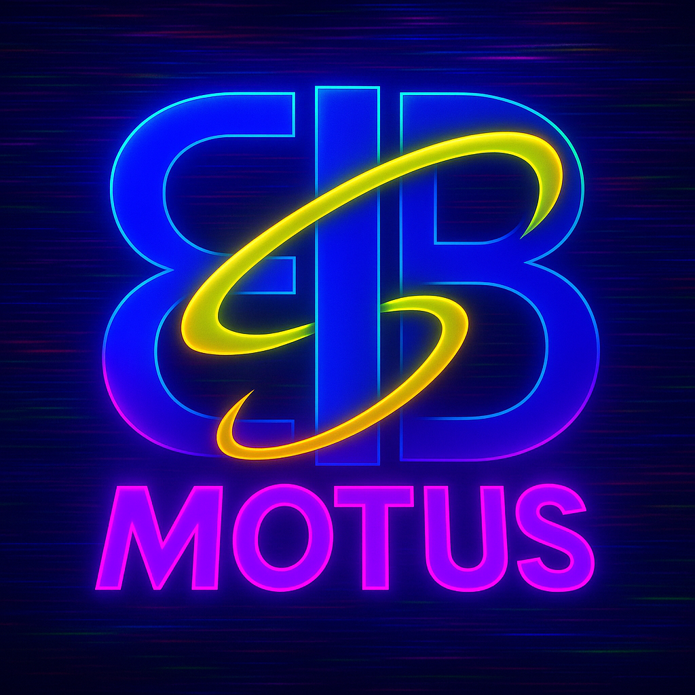
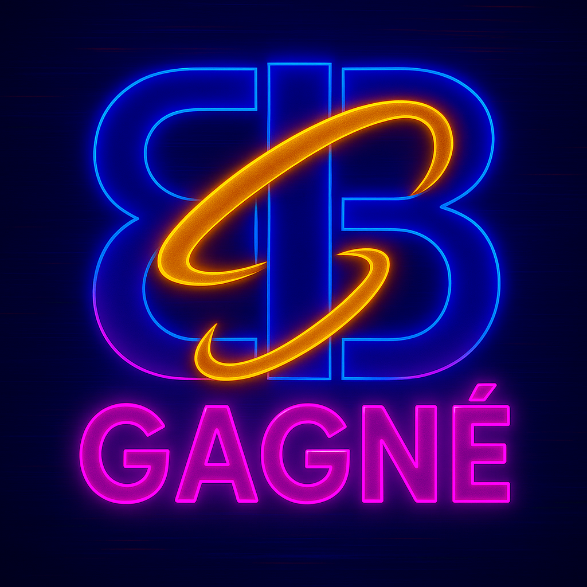
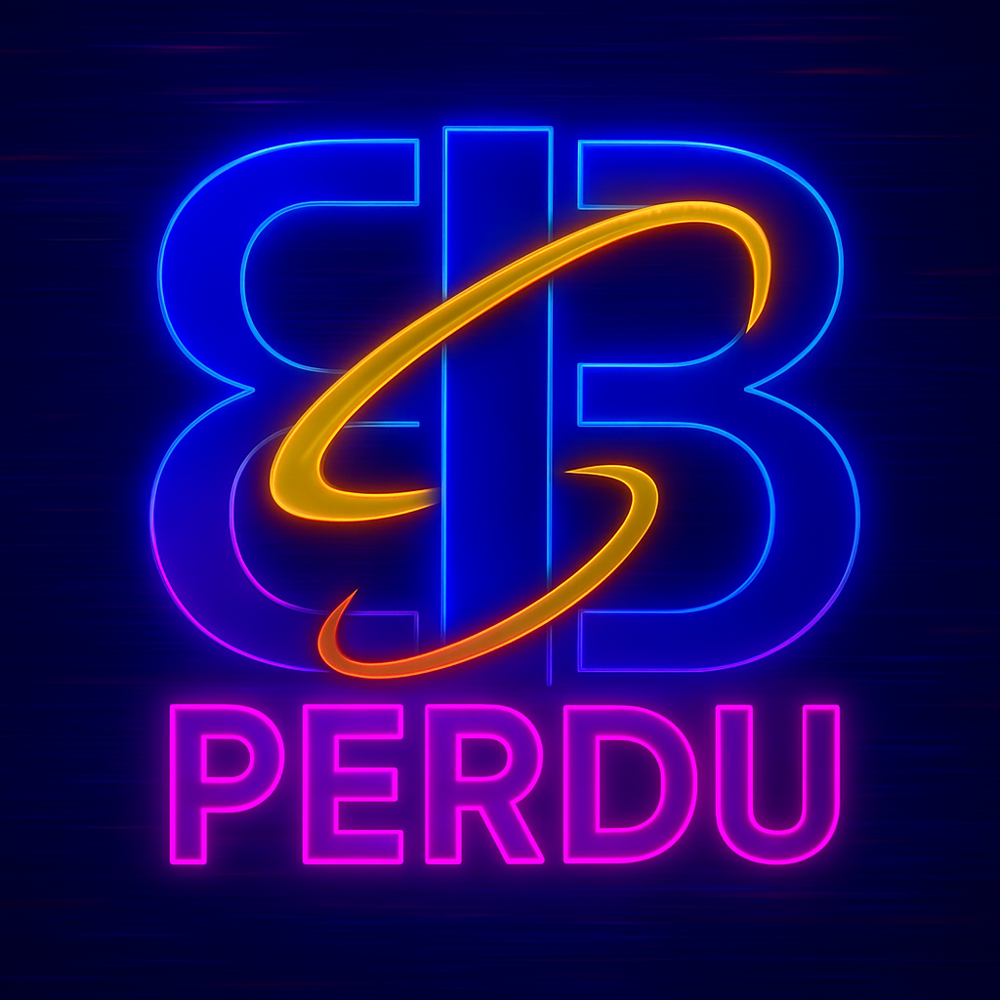
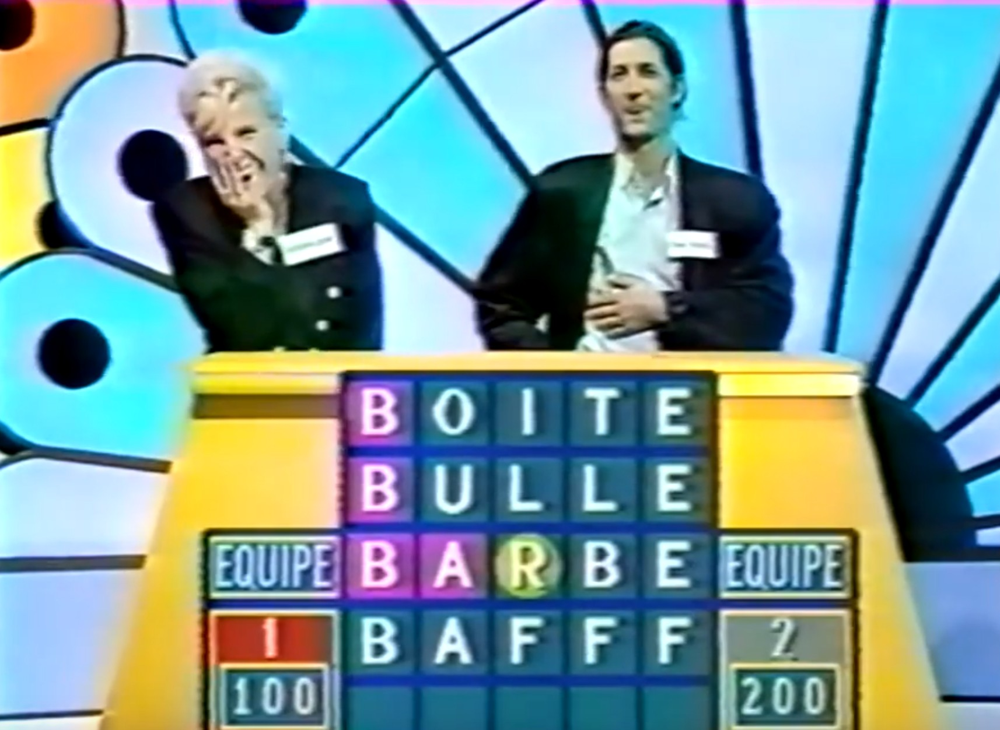

<p align="center">

<p/>
   
# 🧠 MOTUS-MASTER


## 🎓 Projet académique

Ce dépôt contient le code associé au jeu motus. Motus-Master est un projet de Master 1 en Bioinformatique & Biologie des Systèmes (Université Toulouse III), année universitaire 2024-2025. Dans ce projet, on détourne un classique du jeu télévisé pour en faire un laboratoire d'interfaces, d'IA basique, et d’esthétique rétro-futuriste.

Ce projet a été réalisé dans le cadre d’un enseignement de programmation avancée et de conception logicielle, avec un accent particulier sur :
* la structure du projet
* la qualité visuelle et UX (expérience utilisateur)
* la gestion des états et des erreurs
* la communication homme-machine dans un environnement thématique


## Description

> "Salutations à ceux que le destin a placés sur notre chemin."

Dans une ambiance inspirée du cyberpunk, ce jeu de lettres réinvente Motus en y ajoutant :

* un design visuel néon sombre,
* des personnages expressifs aux allures de megacorpo,
* une IA capable de faire des suppositions,
* plusieurs modes de jeu : Joueur contre Joueur, Joueur contre IA, IA contre IA.

Le tout sans tricher... Enfin, sauf quand on soupçonne que quelqu’un l’a fait.


### 🎮 Fonctionnalités

* 🧍‍♂️ Modes de jeu multiples : JcJ (Joueur contre Joueur), JcI (Joueur contre IA), IcI (IA contre IA)
* 🧠 IA simple mais adaptative (filtrage des mauvaises lettres, stratégie sur la première lettre)
* 🧪 Mode console pour les puristes ou tests rapides
* 💡 Interface graphique immersif
* 🌌 Univers visuel cohérent (personnages, écrans de victoire/défaite, ambiance cyber-futuriste)


### 🛠️ Technologies utilisées

* Java (Swing)
* Génération d’images IA pour les visuels de fin


## Structure
```
📁 Motus-Master/
├── README.md                  # Présentation du projet
├── LICENSE                    # Licence d'utilisation
├── .gitignore                 # Fichiers/dossiers ignorés par Git
├── 📁 src/                    # Code source Java
│   ├── CaseLabel.java         # Case de la grille avec états visuels (JLabel personnalisé)
│   ├── Game.java              # Interface principale du jeu, logique de partie
│   ├── Humain.java            # Implémentation d’un joueur humain
│   ├── Initialize.java        # Fenêtre Swing de base (taille, fond, fermeture)
│   ├── Joueur.java            # Interface pour tous les joueurs (humain ou IA)
│   ├── LoadData.java          # Chargement et sélection aléatoire de mots
│   ├── Menu.java              # Menu principal du jeu
│   ├── Plateau.java           # Version console du jeu
│   ├── ResultsEndGame.java    # Écran de fin de partie (victoire/défaite)
│   ├── Robot.java             # IA du jeu (joueur robot)
│   ├── Rules.java             # Fenêtre d'affichage des règles du jeu
│   ├── SelectionMot.java      # Choix du mot à deviner (dans certains modes)
│   ├── SelectionNumber.java   # Choix du nombre de lettres du mot
│   ├── SelectionType.java     # Choix du type JcI : IA devine ou fait deviner
├── 📁 bin/                    # Fichiers compilés avec Java version 65.0
├── 📁 data/                   # Fichiers externes de données
│   ├── mots_6_lettres.csv     # Liste de mots de 6 lettres
│   ├── mots_7_lettres.csv     # Liste de mots de 7 lettres
│   ├── mots_8_lettres.csv     # Liste de mots de 8 lettres
│   ├── mots_9_lettres.csv     # Liste de mots de 9 lettres
│   ├── motus.png              # Logo du jeu
│   ├── win.png                # Image affichée en cas de victoire
│   ├── lose.png               # Image affichée en cas de défaite
|   ├── triche.png             # Image affichée en cas de suspicion de triche
|   ├── logo_win.png           # Logo affiché en cas de victoire
|   ├── logo_lose.png          # Logo affiché en cas de défaite
|   ├── logo_triche.png        # Logo affiché en cas de suspicion de triche
|   ├── rmdLore_win.png        # Image affichée en cas de victoire mode facile
|   ├── rmdLore_lose.png       # Image affichée en cas de défaite mode facile
|   ├── rmdLore_triche.png     # Image affichée en cas de suspicion de triche en mode facile
│   ├── Rules.txt              # Texte des règles du jeu
|   ├── Menu.txt               # Texte affiché sur l'écran du menu
|   ├── lien.txt               # Lien vers la source des fichiers csv
```


## INIT PHASE 0 : PRÉREQUIS SYSTÈME

> *"Chargement du noyau Motus... Analyse de l’environnement..."*
> 
> *🔐 Validation des modules requis : en attente d’interface humaine compatible.*


### 🛠️ ENVIRONNEMENT REQUIS

Pour accéder à l’interface de décodage **Motus-Master**, votre poste doit embarquer :

* ☕ **Java 17 ou supérieur**
  *Environnement d’exécution minimum pour activer les modules Swing et l’IA.*

  🔗 [Télécharger le JDK](https://adoptium.net/)

* 🧠 **IDE compatible** (optionnel mais recommandé)
  * IntelliJ IDEA, Eclipse, ou VSCode (avec support Java activé)
  * Les lignes de commande sont tolérées… mais peu ergonomiques.

* 🧬 **Git**

  *Pour le clonage sécurisé du dépôt distant et le suivi de vos expérimentations.*


### 📂 STRUCTURE OPÉRATIONNELLE

Pour éviter les erreurs de chargement ou d’exécution, respectez la hiérarchie suivante :

```
Motus-Master/
├── bin/                   ← Code exécutable (.class)
├── src/                   ← Code source principal (.java)
├── data/                  ← Ressources systèmes (mots, visuels, règles)
│   ├── mots_6_lettres.csv
│   ├── mots_7_lettres.csv
│   ├── mots_8_lettres.csv
│   ├── mots_9_lettres.csv
│   ├── motus.png
│   ├── win.png / loose.png
│   ├── Rules.txt
```
>[!NOTE]
>📌 *Note tactique :* les chemins sont relatifs.

>[!WARNING]
>🚫 Déplacer les fichiers hors de `data/` entraîne une perte de liaison logique avec les composants visuels et lexicaux.


### 🧪 MODES D’EXÉCUTION

Deux protocoles sont disponibles :

* 🖥️ **Interface graphique**
  
  *Lancer `Menu.java` pour naviguer à travers les modules visuels (Swing).*

* ⌨️ **Mode console** (fallback)
  
  *Lancer `Plateau.java` pour exécuter le jeu dans un terminal textuel.*


> *"Préparation terminée. En attente d’exécution. Appuyez sur \[ENTER] pour initialiser le système."*


## INIT PHASE 1 : INSTALLATION & DÉMARRAGE

> *"Connexion au terminal local établie... Chargement du noyau Motus en mémoire volatile..."*
> 
> *Veuillez suivre le protocole ci-dessous pour activer l’environnement de simulation.*


### 📥 INSTALLATION

Si vous utilisez Git :

   ```bash
   git clone https://github.com/CamilleAstrid/fr.univ-tlse3.Motus-Master.git
   cd fr.univ-tlse3.Motus-master.git
   ```

Sinon, récupérez manuellement l’archive du projet et assurez-vous que l’arborescence respecte celle décrite plus haut.


### ▶️ DÉMARRAGE DU SYSTÈME

**🖥️ Mode Interface Graphique (recommandé)**

Démarre le système en mode visuel enrichi (Swing, boutons, images, IA, karma inclus)

* Méthode 1 — Depuis un IDE :
   * Ouvrir le dossier `fr.univ-tlse3.Motus-master` dans IntelliJ, Eclipse ou VSCode.
   * Lancer la classe `Menu.java` comme application Java.
* Méthode 2 — En ligne de commande :
   * Lancer la commande suivante
   ```bash
   javac src/*.java -d bin
   cd bin
   java Menu
   ```

**⌨️ Mode Console (Fallback textuel)**

Démarre le jeu sans interface graphique — pour les adeptes du terminal brut.

```bash
javac src/*.java -d bin
cd bin
java Plateau
```


### 🧠 Recommandations

* Activez le **mode plein écran** pour une immersion optimale.
* Vérifiez que les fichiers `CSV` sont lisibles et encodés en `UTF-8`.
* Évitez d’exécuter depuis un chemin contenant des espaces (certains systèmes n’aiment pas ça).

> *"Système initialisé. Prêt à recevoir les entrées du joueur. Que la partie commence."*


## Règles du jeu

**Motus-Master** est une simulation de déchiffrage où le joueur (ou l'IA) doit identifier un **mot secret** choisi aléatoirement, dans une ambiance rétro-futuriste.

### 🎯 Objectif

* Deviner un mot de **6 à 9 lettres**.
* La **première lettre est donnée**.
* Vous avez :
  * **6 tentatives** en mode normal/difficile,
  * **10 tentatives + menu d’aide** en mode facile.

### 🧠 Feedback

À chaque proposition :

* 🟥 **Carré rouge** → lettre correcte et bien placée
* 🟡 **Rond jaune** → lettre présente mais mal placée
* Rien → lettre absente

### ❌ Erreurs invalidantes

Un mot est rejeté s’il est :

* Inexistant ou mal orthographié
* Trop court / trop long
* Ne commence pas par la lettre imposée
* Est un **nom propre**
* Est un **verbe conjugué** (sauf participe ou infinitif)

### ✅ Conditions de victoire

* **Victoire** : toutes les lettres sont trouvées et bien placées avant la fin des tentatives.



* **Défaite** : aucune proposition complète correcte après 6 essais (ou 10 en mode facile).



* En **mode équipe** (à venir) :
  * Chaque mot correct rapporte **50 points**.
  * Le dernier mot vaut **100 points**.
  * La main passe à l’adversaire en cas d’erreur ou d’échec.
  * Une lettre est révélée à chaque changement de main.

> *"Décryptez le mot. Résistez aux erreurs. Dominez le système."*


## Licence
Ce projet et donc l'ensemble des éléments de ce répertoire est sous licence [MIT](https://github.com/CamilleAstrid/fr.univ-tlse3.Motus-Master/blob/master/LICENSE) (sauf cas précisé).


## Citations et Références

**Toute ressemblance avec des faits et des personnages existants ou ayant existé serait purement fortuite et ne pourrait être que le fruit d'une pure coïncidence.**

La première émission du jeu télévisé MOTUS : [BAFFF](https://www.google.com/url?sa=t&source=web&rct=j&opi=89978449&url=https://www.youtube.com/watch%3Fv%3D5SEbbjTvbdc&ved=2ahUKEwiMi8_u26iNAxUMVaQEHYN6MjEQtwJ6BAgfEAI&usg=AOvVaw1aRx66XZFw0AHce1u1mFU-)



> «Qu’est-ce que c’est que Motus ? C’est une espèce de gymnastique du cerveau qui mélange les chiffres d’un côté et les lettres... Il faut savoir aller vite, être logique et avoir envie de jouer.»
>
> «Ceux qui n’ont pas bien compris le fonctionnement du jeu, c’est très simple, je vous invite à jouer.»

-- Thiery Beccaro, 25 juin 1990, [première émission](https://tvmag.lefigaro.fr/programme-tv/motus-quand-thierry-beccaro-essayait-d-expliquer-les-regles-du-jeu-lors-de-la-premiere_8a634ef8-709c-11e9-91e1-c96190258bb7)


## Auteurs
Copyright (C) 2025 CamilleAstrid

---
>[!NOTE]
> Pour toute question, veuillez me contacter par mail : [Camille-Astrid Rodrigues](mailto:camilleastrid.cr@gmail.com)
>
> Si des ajustements ou des ajouts sont nécessaires, n'hésitez pas à me le signaler !
